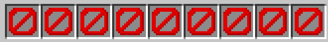

# NoInventory



## Description

This is a simple `minecraft spigot plugin` that allows you to limit the amount of slots players have in their inventory.
It uses the Spigot 1.19 API and Java SDK 17.

You may want to use this plugin to challenge yourself and your friends by limiting the amount of different items they
can carry in their inventory.

## Usage

To use this plugin, simply download the latest release and put it in your `plugins` folder. Then, restart your server,
and you're good to go!

## Configuration

The configuration file is located in the `plugins/NoInventory` folder and is called `config.yml`. The default
configuration is as follows:

```yaml
# The maximum amount of slots players have in their inventory
slotlimit: 9
```

## Commands

- **/slotlimit <amount>** - Displays or sets the maximum amount of slots players have in their inventory

## Examples

One enabled the plugin directly limits the amount of slots players have in their inventory to 9. This can be changed in
the configuration file or by using the `/slotlimit` command.


Using the slot limit command,
you can set the maximum amount of slots players have
in their inventory. For example,
if you want to set the maximum amount of slots players
have in their inventory to 2,
you can use the following command:


Now just hit enter, and you're inventory will be limited to 2 slots.


Don't worry to lose items during this process, instead of removing them, the plugin will drop them for you.


## License

This project is licensed under the [MIT License](LICENSE).
